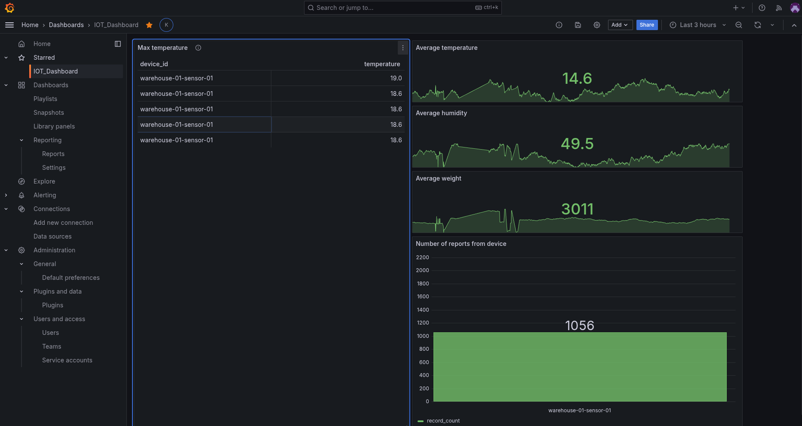
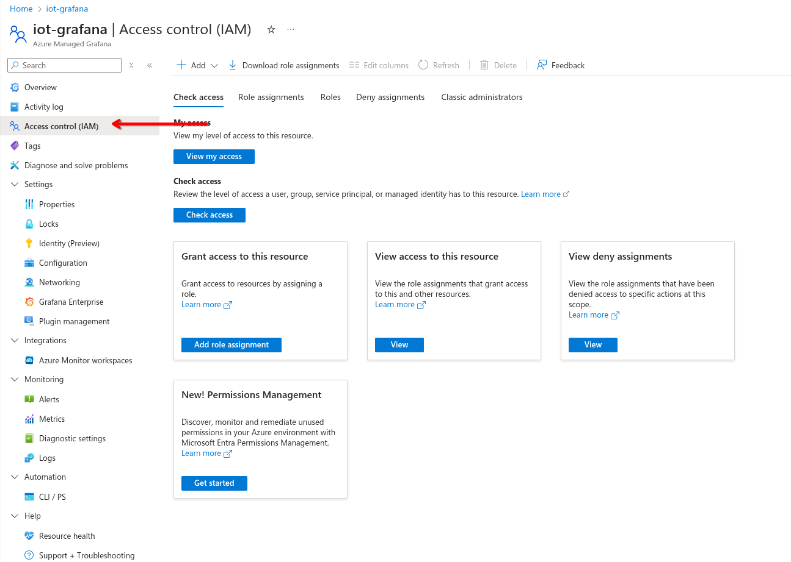
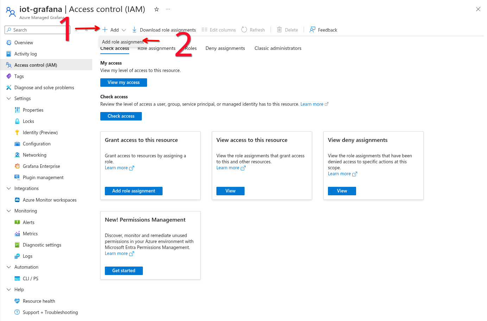
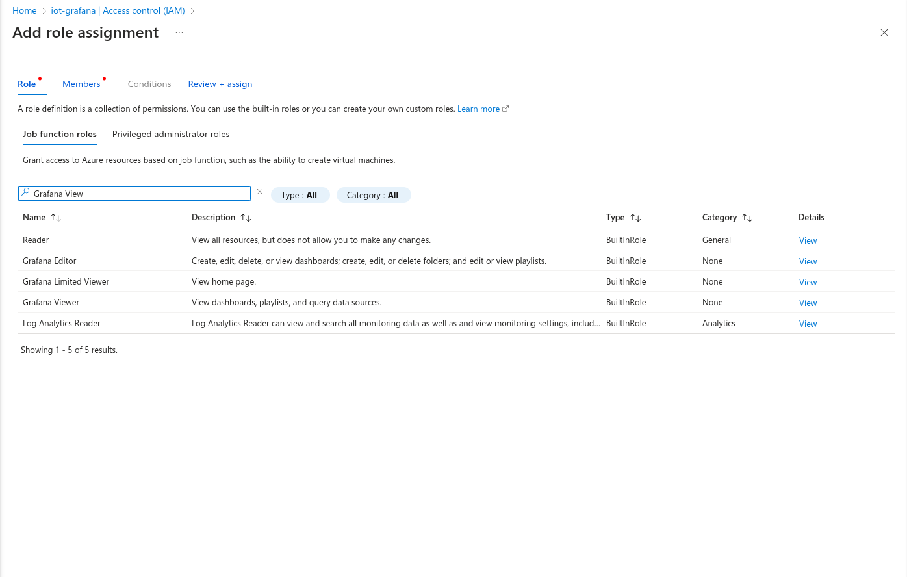
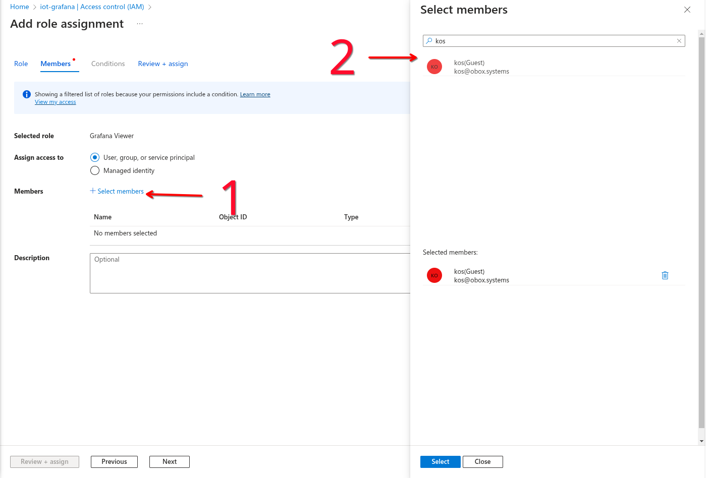

# Grafana

The Grafana dashboard is designed to visualize data from the database, providing real-time insights and monitoring capabilities.

## Frontend

For the frontend, we use Grafana, which is accessible via [this link](https://iot-grafana-e3ewgph5cabrc6at.weu.grafana.azure.com/d/cebgcjrdq7togc/iot-dashboard).

Grafana provides dynamic and interactive dashboards that allow real-time monitoring of data from your database. It can also can trigger alerts based on predefined conditions and notify via email, other integrations when critical events occur.

## User management

To add read access to your managed Grafana in Azure:

1. **Open Azure Managed Grafana**: Go to your Azure Managed Grafana instance in the Azure portal.
2. **Access Control (IAM)**: In the left menu, select **Access control (IAM)**.
   
3. **Add Role Assignment**: Click on **Add role assignment**.
   
4. **Select Role**: Choose the **Grafana Viewer** role for read-only access to dashboards. Alternatively, you can choose **Grafana Editor** for read-write access if needed.
   
6. **Assign Access**: Select the user, group, or service principal you want to grant access to. Click **Select members**, pick the members, and then confirm with **Select**.
   
7. **Review and Assign**: Click **Next**, review the details, and then click **Review + assign** to complete the role assignment.

This will grant the selected users read-only access to your Grafana dashboards.

## Customer Sign Up process

Users are added manually and are intended for internal use only. 
They do not have access to the system as anonymous users. 
This ensures that only authorized personnel can interact with the data.