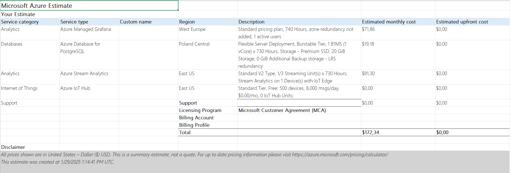
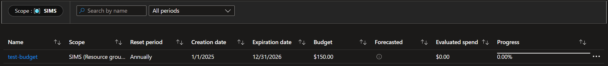

# Azure Pricing Estimate and Budget Details

## Cost Estimate
The **Microsoft Azure Pricing Calculator** was used to estimate the monthly costs for the services required by the IoT SIMS project. Below is a breakdown of the calculated costs:
[Download ExportedEstimate.xlsx](ExportedEstimate.xlsx)

## Budget Limit and Alerts
A budget has been defined for the IoT SIMS project to control costs. Here are the budget details:

The budget limit is configured to send **alerts** when spending approaches or exceeds the allocated amount. Additionally, **hooks** can be set up to **automatically disable services** when the budget limit is reached. This ensures that the project remains cost-effective and avoids unexpected overages.
